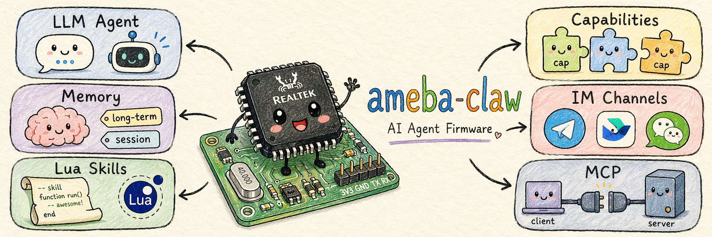

<div align="center">

  

  # ameba-claw

  <p>
    <b>💬 Talk to It · 🦾 It Learns New Tricks · 🔌 React to Anything · 🔒 All On-Chip</b>
  </p>

  <p>
    <a href="./LICENSE">
      
    </a>
    <a href="https://aiot.realmcu.com/en/home.html">
      
    </a>
    
  </p>

  <p>
    <a href="#-quick-start">Quick Start</a> ·
    <a href="#-key-features">Features</a> ·
    <a href="#-architecture">Architecture</a> ·
    <a href="#-lua-skills">Lua Skills</a> ·
    <a href="#-at-command-interface">AT Commands</a> ·
    <a href="README_CN.md">中文</a>
  </p>

</div>

---

**Ameba-Claw** is Realtek's AI Agent framework for Ameba SoC chips. It runs a full ReAct agent loop — sense, decide, act — entirely on Realtek Ameba hardware under Ameba-RTOS, with no Linux and no external server. Connect to WiFi, point it at an LLM API, and interact through Telegram, Feishu, WeChat, or a serial terminal. Write Lua skills at runtime to extend what the agent can do — no recompile needed.

## 💡 How It Works

You send a message on Telegram (or Feishu, WeChat, or the serial terminal). The chip picks it up over WiFi, assembles context — long-term memory, session history, current time, available tools and skills — and fires an LLM API call. The LLM thinks, calls tools (GPIO, web search, Lua skills, file ops…), loops until the task is done, then sends the reply back to wherever the message came from. Everything runs on a single chip; your data never leaves the device.

## 🌟 Key Features

<table>
  <tr>
    <td><b>💬 Chat to Program</b></td>
    <td>Send a message, get a response. The LLM calls tools, runs Lua skills, and replies — all on-device.</td>
  </tr>
  <tr>
    <td><b>🦾 Lua Skills</b></td>
    <td>Write skills in Lua at runtime via IM or serial. GPIO, I2C, SPI, UART, IR, RTC, PWM, audio — all scriptable.</td>
  </tr>
  <tr>
    <td><b>🧬 Structured Memory</b></td>
    <td>Profile, session history, and long-term memory stored locally in flash. Privacy stays on-chip.</td>
  </tr>
  <tr>
    <td><b>📤 MCP Support</b></td>
    <td>Connects to external MCP servers and exposes its own capabilities as an MCP server.</td>
  </tr>
  <tr>
    <td><b>📅 Scheduler</b></td>
    <td>The LLM can schedule its own recurring or one-shot tasks, persisted across reboots.</td>
  </tr>
  <tr>
    <td><b>🌐 Multi-IM</b></td>
    <td>Telegram, Feishu, WeChat (iLink), QQ, and a built-in local WebIM.</td>
  </tr>
  <tr>
    <td><b>🔌 Event Driven</b></td>
    <td>Any event (IM message, GPIO trigger, timer) can invoke the agent loop.</td>
  </tr>
</table>

## 🖥️ Supported Platforms

| | |
|---|---|
| **Ameba SoC** | RTL8721F / RTL8711F |
| **LLM** | OpenAI, Anthropic, Alibaba Qwen, DeepSeek, or any OpenAI-compatible endpoint |
| **IM** | Telegram, Feishu, WeChat (iLink), QQ, local browser WebIM |

## 🚀 Quick Start

### What You Need

- A **Realtek Ameba development board** (RTL8721F or RTL8711F)
- A **USB cable** for flashing and serial access
- An **LLM API key** — from [OpenAI](https://platform.openai.com), [Anthropic](https://console.anthropic.com), or any OpenAI-compatible provider
- (Optional) A **Telegram bot token** — from [@BotFather](https://t.me/BotFather)

### Build

```bash
# Set up the build environment
source env.sh

# Select your SoC
python ameba.py soc RTL8721F

# Build
python ameba.py build -a /path/to/ameba_claw
```

### Flash & Monitor

```bash
# Flash
python ameba.py flash -p /dev/ttyUSB0 -b 1500000

# Open serial monitor
python ameba.py monitor -p /dev/ttyUSB0 -b 1500000
```

### Configure

On first boot, the device starts a SoftAP named `AmebaClaw-XXYY` (last two MAC bytes). Connect and open `http://192.168.1.1` to set up WiFi and LLM credentials. Everything can also be configured via the AT command interface below.

> **USB features** (UVC camera, MSC storage): enable USB OTG/Host in Kconfig before building. A preset is provided in `prj.conf`.

## ⌨️ AT Command Interface

```
AT+CLAW=ask,<message>              chat with the agent
AT+CLAW=lua_repl                   enter Lua REPL

AT+CLAW=cfg                        show LLM config
AT+CLAW=cfg,key,<val>              set API key
AT+CLAW=cfg,model,<val>            set model
AT+CLAW=cfg,url,<val>              set API URL
AT+CLAW=cfg,backend,<0|2>          0=Bearer(OpenAI)  2=Anthropic
AT+CLAW=cfg,wifi,<ssid>,<pass>     connect WiFi
AT+CLAW=wifi,clear                 reset WiFi, reboot to SoftAP

AT+CLAW=memory,list|clear          manage long-term memory
AT+CLAW=session,list|clear[,all]   manage session history
AT+CLAW=lua_execute_sync,<path>[,<args>]   run a .lua file by path, blocking until done
AT+CLAW=lua_execute_async,<path>[,<args>]  run a .lua file by path as a background job (returns job_id)
AT+CLAW=cap                        list registered capabilities
AT+CLAW=fs,list|delete,<path>      browse / delete VFS files
```

## 🧠 Memory

| File | Description |
|------|-------------|
| `vfs:/AGENTS.md` | System prompt and agent role definition |
| `vfs:/SOUL.md` | Agent personality |
| `vfs:/IDENTITY.md` | Agent identity |
| `vfs:/USER.md` | User info — name, preferences, language |
| `vfs:/MEMORY.md` | Long-term memory |
| `vfs:/session/<id>.jsonl` | Per-session conversation history |
| `vfs:/skills/<name>/` | Installed Lua skills |
| `vfs:/scheduler/` | Scheduled job definitions |
| `vfs:/mcp/` | MCP server configurations |

## 🦾 Lua Skills

Skills are Lua scripts at `vfs:/skills/<name>/main.lua`. The agent can load, run, and write new skills at runtime.

**Built-in skills:**

| Skill | Description |
|-------|-------------|
| `board_hardware_info` | Inspect board peripherals, interfaces, and free pins — activate before any hardware script |
| `builtin_lua_modules` | Index of available Lua module APIs — activate when writing Lua skills |
| `usb_file` | Read, write, list, and delete files on a FAT32 USB flash drive |
| `skill_authoring` | Meta-skill: helps the LLM write and save new skills |

**Hardware modules:** `gpio` · `i2c` · `spi` · `uart` · `ir` · `rtc` · `pwm` · `lcdc` · `adc` · `thermal` · `touch` · `audio` · `usb_uvc` · `usb_msc`

**Software modules:** `timer` · `file` · `udp` · `wifi` · `cap` · `event` · `cjson` · `sys`

> Modules can be individually enabled/disabled via the web UI. `sys`, `cap`, and `cjson` are always on in skill scripts.

## 🏗️ Architecture

<div align="center">
  
</div>

## 🛠️ For Developers

- **Adding a capability** — implement `claw_cap_descriptor_t`, register via `claw_cap_register_group()`.
- **AT command reference** — see the comment header in `cap_atcmd.c`.
- **Config schema** — `claw_modules/claw_config/include/claw_config.h`.

## 🙏 Acknowledgments

Inspired by [OpenClaw](https://github.com/openclaw/openclaw) and [MimiClaw](https://github.com/memovai/mimiclaw). Ameba-Claw reimplements the embedded AI agent architecture for Realtek Ameba-RTOS — pure C, no Linux, no external server.
