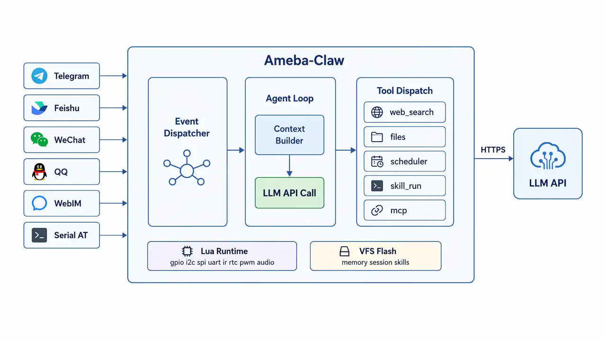

<div align="center">

  

  <p>
    <b>💬 与它对话 · 🦾 随时学习新技能 · 🔌 响应任意事件 · 🔒 全程在芯片上</b>
  </p>

  <p>
    <a href="./LICENSE">
      
    </a>
    <a href="https://aiot.realmcu.com/zh/home.html">
      
    </a>
    
  </p>

  <p>
    <a href="#-快速开始">快速开始</a> ·
    <a href="#-核心特性">核心特性</a> ·
    <a href="#️-系统架构">系统架构</a> ·
    <a href="#-lua-skill-系统">Lua Skills</a> ·
    <a href="#️-at-命令接口">AT 命令</a> ·
    <a href="README.md">English</a>
  </p>

</div>

---

**Ameba-Claw** 是 Realtek 面向 Ameba SoC 芯片的 AI Agent 框架。它在 Ameba-RTOS 上运行完整的 ReAct Agent 闭环——感知、决策、执行——无需 Linux，无需外部服务器。连接 WiFi，配置 LLM API，即可通过 Telegram、飞书、微信或串口终端与 Agent 交互。在运行时用 Lua 编写 Skill 来扩展 Agent 能力，无需重新编译。

## 💡 工作原理

你在 Telegram（或飞书、微信、串口终端）发送一条消息，芯片通过 WiFi 收到后，组装上下文——长期记忆、会话历史、当前时间、可用工具和 Skill——然后发起 LLM API 调用。LLM 进行推理、调用工具（GPIO、网络搜索、Lua Skill、文件操作……），循环直到任务完成，最后将回复发回消息来源。整个过程运行在单颗芯片上，数据不离开设备。

## 🌟 核心特性

<table>
  <tr>
    <td><b>💬 聊天即造物</b></td>
    <td>发送一条消息，Agent 调用工具、运行 Lua Skill，然后回复——全程在芯片上完成。</td>
  </tr>
  <tr>
    <td><b>🦾 Lua Skill</b></td>
    <td>通过 IM 或串口在运行时用 Lua 编写 Skill。GPIO、I2C、SPI、UART、IR、RTC、PWM、音频——均可脚本化。</td>
  </tr>
  <tr>
    <td><b>🧬 结构化记忆</b></td>
    <td>个人资料、会话历史和长期记忆均存储在本地 Flash 中，隐私不上云。</td>
  </tr>
  <tr>
    <td><b>📤 MCP 支持</b></td>
    <td>可连接外部 MCP Server，也可将自身能力作为 MCP Server 对外暴露。</td>
  </tr>
  <tr>
    <td><b>📅 任务调度</b></td>
    <td>LLM 可自主调度定时或单次任务，重启后依然有效。</td>
  </tr>
  <tr>
    <td><b>🌐 多 IM 平台</b></td>
    <td>支持 Telegram、飞书、微信（iLink）、QQ 及内置本地 WebIM。</td>
  </tr>
  <tr>
    <td><b>🔌 事件驱动</b></td>
    <td>任意事件（IM 消息、GPIO 触发、定时器）均可触发 Agent 循环。</td>
  </tr>
</table>

## 🖥️ 支持的平台

| | |
|---|---|
| **Ameba SoC** | RTL8721F / RTL8711F |
| **LLM** | OpenAI、Anthropic、阿里云 Qwen、DeepSeek 或任意 OpenAI-compatible 端点 |
| **IM** | Telegram、飞书、微信（iLink）、QQ、本地浏览器 WebIM |

## 🚀 快速开始

### 所需准备

- 一块 **Realtek Ameba 开发板**（RTL8721F 或 RTL8711F）
- 一根 **USB 数据线**，用于烧录和串口访问
- 一个 **LLM API Key**——来自 [OpenAI](https://platform.openai.com)、[Anthropic](https://console.anthropic.com) 或任意 OpenAI-compatible 服务商
- （可选）一个 **Telegram Bot Token**——向 [@BotFather](https://t.me/BotFather) 申请

### 编译

```bash
# 配置构建环境
source env.sh

# 选择目标 SoC
python ameba.py soc RTL8721F

# 编译
python ameba.py build -a /path/to/ameba_claw
```

### 烧录与监控

```bash
# 烧录
python ameba.py flash -p /dev/ttyUSB0 -b 1500000

# 打开串口监控
python ameba.py monitor -p /dev/ttyUSB0 -b 1500000
```

### 配置

设备首次启动时会开启一个名为 `AmebaClaw-XXYY` 的热点（`XXYY` 为设备 MAC 地址最后两个字节），连接后在浏览器打开 `http://192.168.1.1` 即可完成 WiFi 和 LLM 凭据的配置。也可通过下方的 AT 命令串口接口进行全部配置。

> **USB 功能**（UVC 摄像头、MSC 存储）：编译前需在 Kconfig 中启用 USB OTG/Host。仓库根目录的 `prj.conf` 提供了开箱即用的预设配置。

## ⌨️ AT 命令接口

```
AT+CLAW=ask,<消息>                 与 Agent 对话
AT+CLAW=lua                        进入 Lua REPL

AT+CLAW=cfg                        查看 LLM 配置
AT+CLAW=cfg,key,<val>              设置 API Key
AT+CLAW=cfg,model,<val>            设置模型
AT+CLAW=cfg,url,<val>              设置 API URL
AT+CLAW=cfg,backend,<0|2>          0=Bearer(OpenAI)  2=Anthropic
AT+CLAW=cfg,wifi,<ssid>,<pass>     立即连接 WiFi
AT+CLAW=wifi,clear                 清除 WiFi 配置，重启进入 SoftAP

AT+CLAW=memory,list|clear          管理长期记忆
AT+CLAW=session,list|clear[,all]   管理会话历史
AT+CLAW=skill,<name>[,<args>]      直接运行 Lua Skill
AT+CLAW=cap                        列出已注册的 Capability
AT+CLAW=fs,list|delete,<path>      浏览 / 删除 VFS 文件
```

## 🧠 记忆系统

| 文件 | 说明 |
|------|------|
| `vfs:/AGENTS.md` | 系统提示词与 Agent 角色定义 |
| `vfs:/SOUL.md` | Agent 人格设定 |
| `vfs:/IDENTITY.md` | Agent 身份定义 |
| `vfs:/USER.md` | 用户信息——姓名、偏好、语言 |
| `vfs:/MEMORY.md` | 长期记忆 |
| `vfs:/session/<id>.jsonl` | 各会话的对话历史 |
| `vfs:/skills/<name>/` | 已安装的 Lua Skill |
| `vfs:/scheduler/` | 调度任务定义 |
| `vfs:/mcp/` | MCP Server 配置 |

## 🦾 Lua Skill 系统

Skill 是存储在 `vfs:/skills/<name>/main.lua` 中的 Lua 脚本，Agent 可在运行时加载、执行、编写新 Skill。

**内置 Skill：**

| Skill | 说明 |
|-------|------|
| `board_hardware_info` | 查询开发板外设、接口和空闲引脚——编写任何硬件脚本前请先激活 |
| `builtin_lua_modules` | Lua 模块 API 索引——编写 Lua Skill 时激活以查询精确接口 |
| `usb_file` | 读写、列出、删除 USB Host 上 FAT32 U 盘中的文件 |
| `skill_authoring` | 元 Skill：辅助 LLM 编写并保存新 Skill |

**硬件模块：** `gpio` · `i2c` · `spi` · `uart` · `ir` · `rtc` · `pwm` · `lcdc` · `adc` · `thermal` · `touch` · `audio` · `usb_uvc` · `usb_msc`

**软件模块：** `timer` · `file` · `udp` · `wifi` · `cap` · `event` · `cjson` · `sys`

> 各模块可通过 Web UI 按位掩码独立开关。Skill 脚本中 `sys`、`cap`、`cjson` 始终启用，不可关闭。

## 🏗️ 系统架构

<div align="center">
  
</div>

## 🛠️ 开发者参考

- **新增 Capability** — 实现 `claw_cap_descriptor_t`，通过 `claw_cap_register_group()` 注册。
- **AT 命令参考** — 见 `cap_atcmd.c` 文件顶部注释。
- **配置项定义** — `claw_modules/claw_config/include/claw_config.h`。

## 🙏 致谢

灵感来自 [OpenClaw](https://github.com/openclaw/openclaw) 和 [MimiClaw](https://github.com/memovai/mimiclaw)。Ameba-Claw 为 Realtek Ameba-RTOS 重新实现了嵌入式 AI Agent 架构——纯 C 语言，无需 Linux，无需外部服务器。
